# Ninja-Academy

##### Ninja Academy is responsive webpage featuring a ficticious martial arts enrolling young men aged 12-18 who want to learn the combat techniques, the teamwork, and the lifestyle of Ninjas.

###### <a href="https://infinite-ocean-23539.herokuapp.com">Hosted Here on Heroku</a>

## Features
  * Bootstrap formatting and classes
  * Carousel of responsive images prepared in CS6
  * Customized Navbar 
   * 3 different on-hover animations demonstrated
   * fully functional on large to mobile viewports  
  * Signup, Registration, and Subscribe modal forms

## Technologies Used
 * HTML5
  * Bootstrap 3
  * Font-Awesome icons
 * CSS3 
   * Button Animations
   * Carousel Transitions
   * Media Queries make it fully responsive
* Back-end
 * Node.js
  * Use Node.js to view on Localhost:3000
 * Express.js
  * static router serving all project files
  * working custom 404 page
## Homepage Bootstrap Carousel

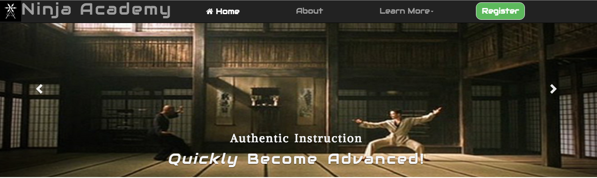

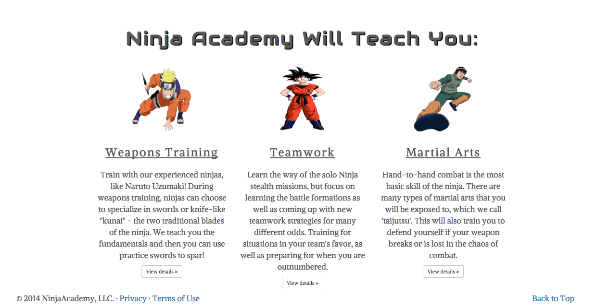

## About Page

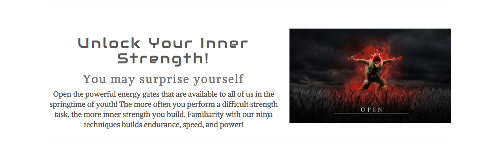

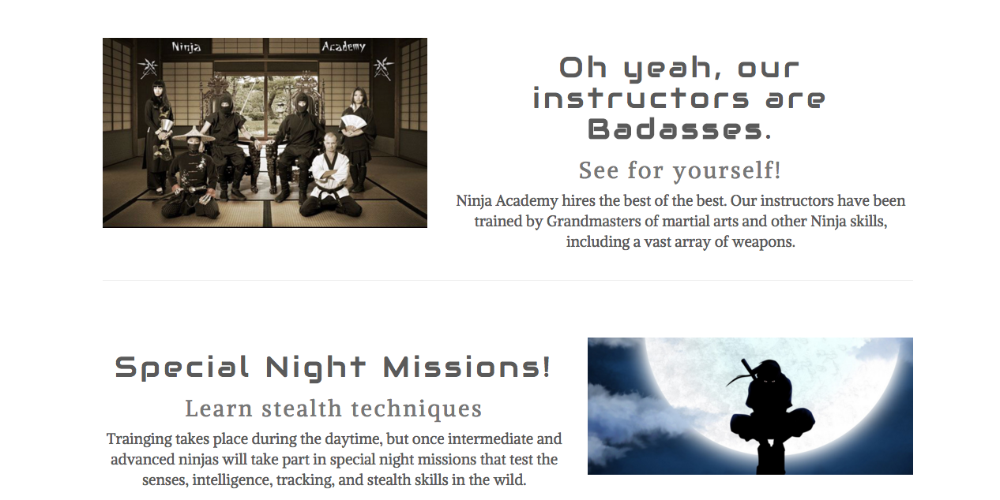

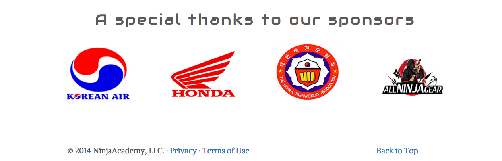

## FAQ Page

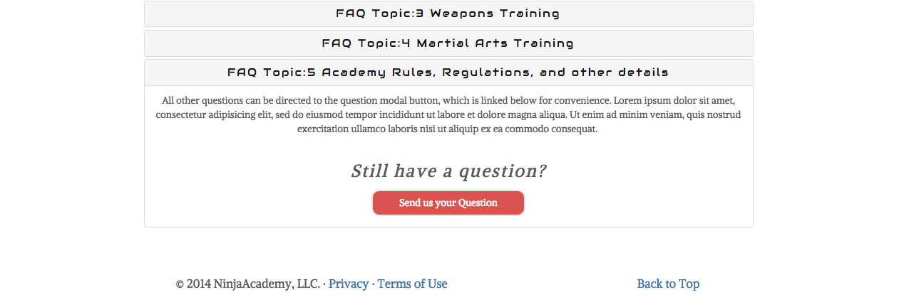

## Testimonials Page

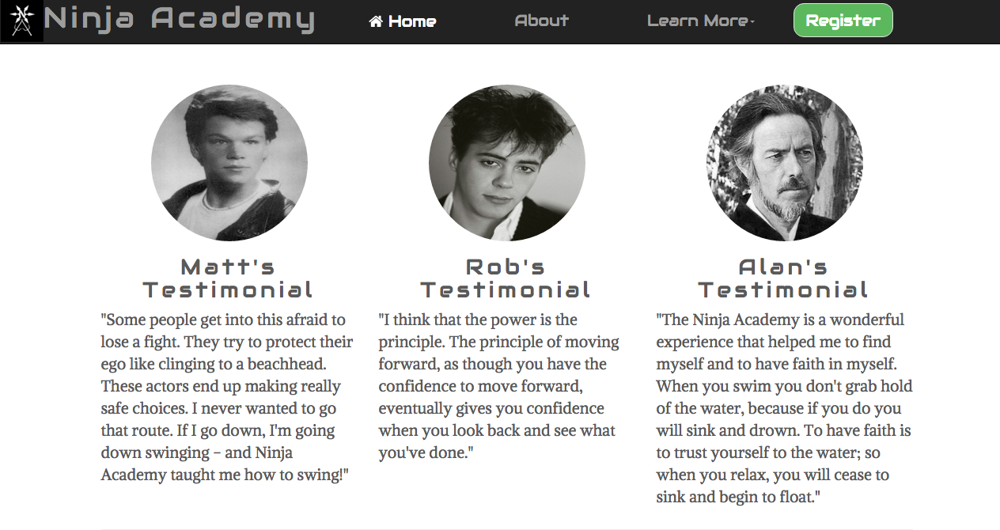

## Custom 404 Page

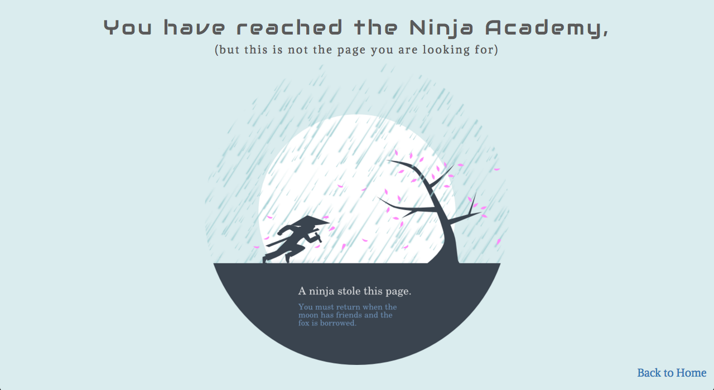

## "Subscribe", "Register", and "Send Us a Comment" Modal Forms

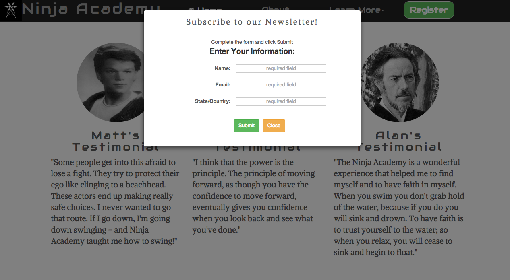

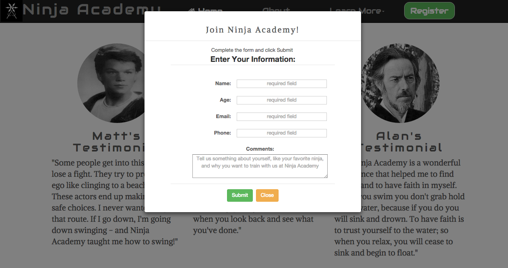

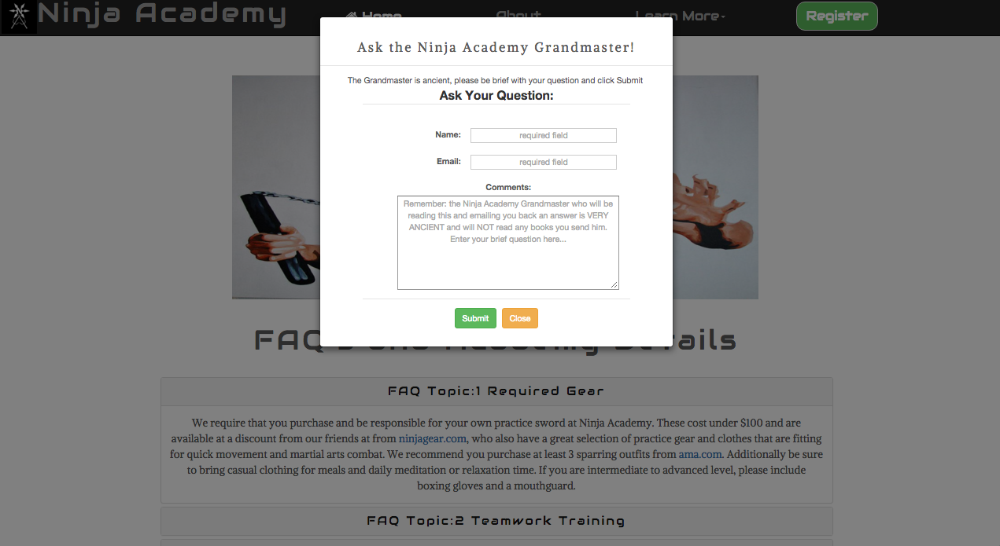